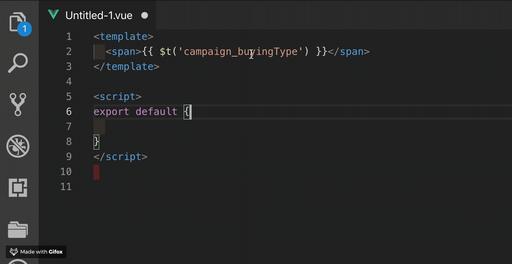
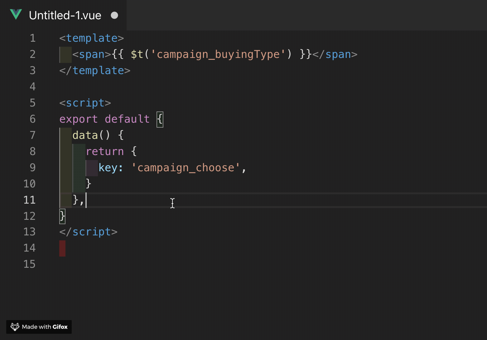
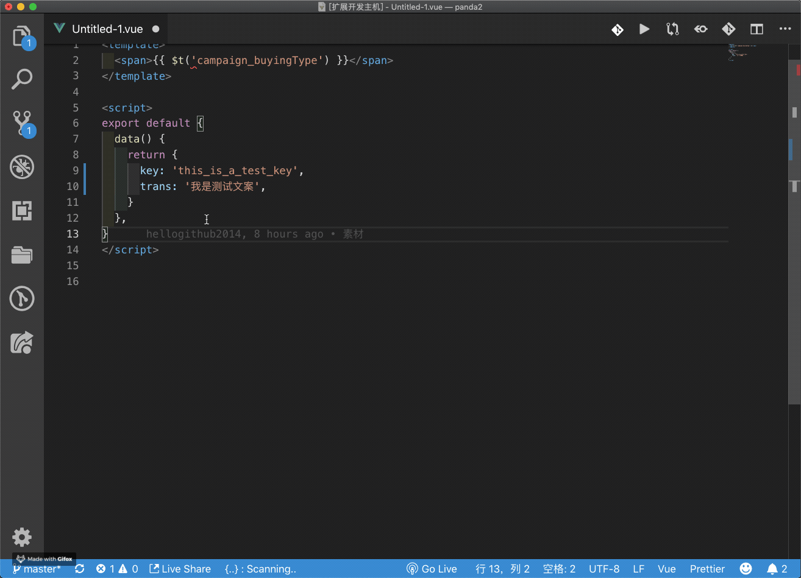
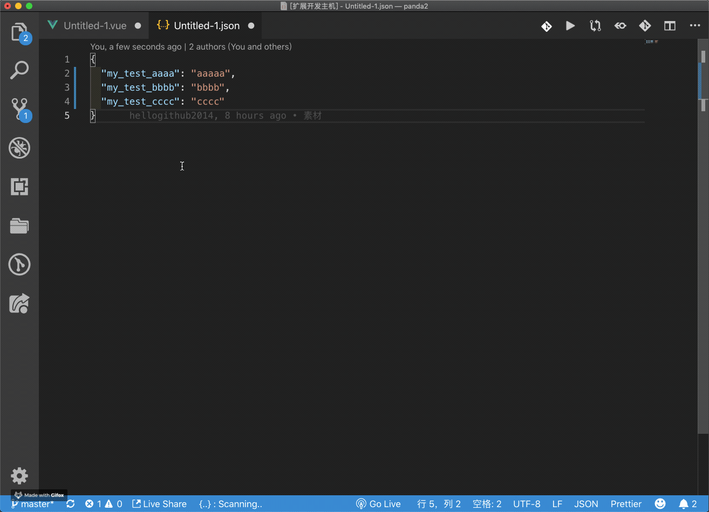
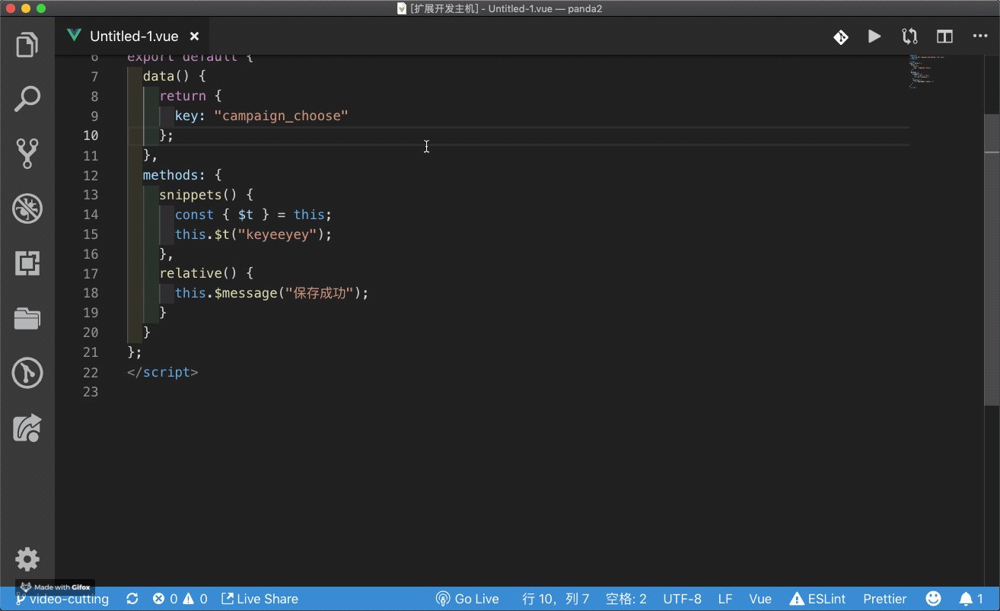
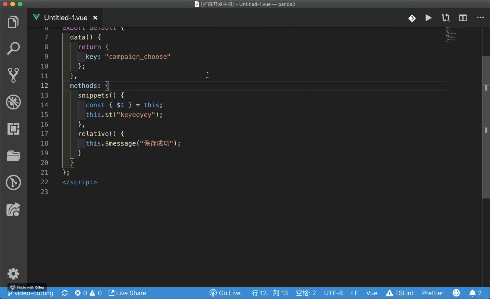
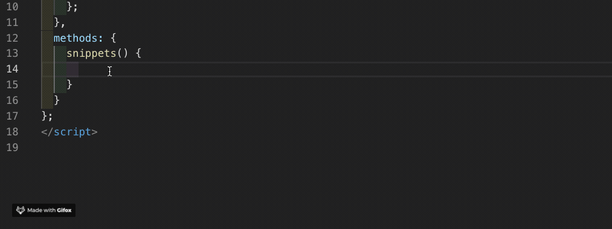
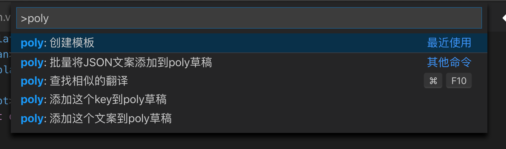
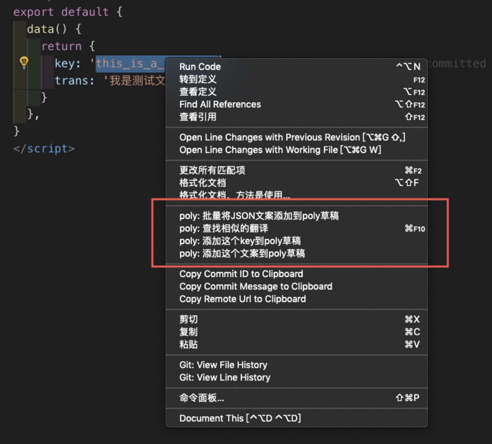

# vscode-poly

用于多语言文案管理Poly的vscode插件。

## 特性

* 自动展示key对应的已有翻译文案
* 添加key到poly草稿
* 添加文案到poly草稿
* 批量将JSON文案添加到poly草稿
* 查找相似的翻译
* 创建poly模板
* 一些相关的snippets

## 用法

注：当前只配置了插件在`js`、`vue`、`json`文件里生效，若有需求在其他类型文件生效可联系我😺

* 自动展示key对应的已有翻译文案
  * 当鼠标悬停在一个`vue-i18n`插件的`key`上时，自动展示这个key对应的文案翻译

  

  * 当选中一些文本时并`hover`时，会自动将这些文本当做`key`并展示对应文案翻译

  

* 添加key到poly草稿

  

* 添加文案到poly草稿

  

* 批量将JSON文案添加到poly草稿

  

* 查找相似的翻译（快捷键`Command + F10`）

  

* 创建poly模板

  

* 一些相关的snippets

  

  snippets的具体信息如下：

  | prefix | snippets content        |
  | ------ | ----------------------- |
  | `t'`   | `this.$t('key')`        |
  | `te'`  | `this.$te('key')`       |
  | `ct'`  | `const { $t } = this;`  |
  | `cte'` | `const { $te } = this;` |

可使用`Command + Option + P`吊起命令面板后，输入`poly`以查找相关支持的命令：

同时也将这些命令加入了右键菜单(需要选中一些文本才会出现poly菜单命令)：

## 配置